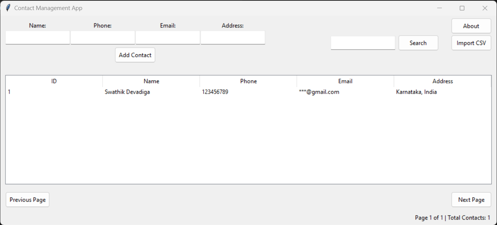

# 📞 Contact Management System

This is a command-line Contact Management System built in Python as part of **Week 1 Tasks** for the `Techplement` repository.



## ✅ Features

- Add new contacts with name, phone, and email
- View all saved contacts
- Search contacts by name (case-insensitive)
- Update contact details using contact ID
- Input validation for phone numbers and email addresses
- Persistent storage using JSON

## 🧱 Project Structure

Techplement/
├── contact_manager.py # Main Python application
├── contacts.json # Automatically created at runtime
├── requirements.txt # No external packages required
└── README.md # This file

## 💡 How to Run

1. Clone this repository:

   ```bash
   git clone https://github.com/yourusername/Techplement.git
   cd Techplement
   
2. Run the application:
   ```bash
   python contact_manager.py

📥 Data Storage
  - All contact data is stored in a JSON file named contacts.json.
  - It is created/updated automatically when you add or modify a contact.

🔒 Input Validation
  - Phone Number: Must contain 7–15 digits, may start with +.
  - Email: Must follow a valid email format like name@example.com.

🚀 Optional Future Enhancements
  - Delete contact feature
  - Sorting/filtering options
  - GUI version using Tkinter or PyQt
